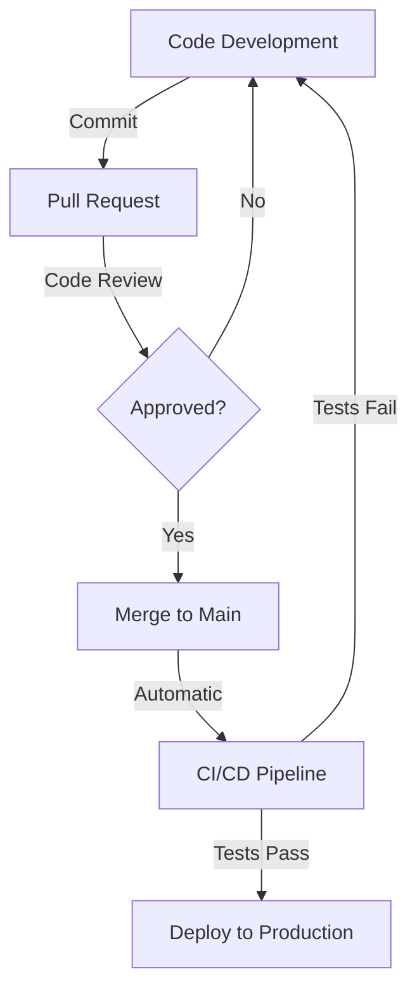

# Dhaval Rupapara

<div align="center">
  <h3>Software Engineer & Full Stack Developer</h3>
  
  
  
  
  
</div>

<div align="center">
  <h4><i>Building scalable applications with modern tech stacks</i></h4>
</div>

[](https://linkedin.com/in/dhaval-rupapara/)
[](https://stackoverflow.com/users/22502147)
[](https://www.leetcode.com/dhaval073)
[](mailto:rupaparadhaval1234@gmail.com)

---

## Professional Summary

```typescript
const dhavalRupapara = {
  title: "Software Engineer & Full Stack Developer",
  specialization: ["Backend Systems", "Cloud Architecture", "API Development"],
  passion: "Building scalable & efficient applications",
  values: ["Clean Code", "Performance", "User Experience", "Open Source"],
  currentFocus: "Contributing to developer community"
};
```

Dedicated Software Engineer with expertise in full-stack development, specializing in backend systems and cloud architecture. Passionate about building scalable, efficient applications with modern technologies. Committed to writing clean, maintainable code and contributing to the developer community.

---

##  Technical Expertise

<table>
  <tr>
    <td valign="top" width="50%">
      <h3>Languages</h3>
      
      
      
      
      
      
      
    </td>
    <td valign="top" width="50%">
      <h3>Frontend Development</h3>
      
      
      
      
      
      
      
      
    </td>
  </tr>
  <tr>
    <td valign="top" width="50%">
      <h3>Backend Development</h3>
      
      
      
      
      
      
      
    </td>
    <td valign="top" width="50%">
      <h3>Database & Cloud</h3>
      
      
      
      
      
      
      
      
      
    </td>
  </tr>
  <tr>
    <td valign="top" colspan="2">
      <h3>DevOps & Tools</h3>
      <div align="center">
        
        
        
        
        
        
      </div>
    </td>
  </tr>
</table>

---

##  Current Focus

<div align="center">
  <table>
    <tr>
      <td align="center"></td>
      <td><b>Backend Development</b>: Building robust, scalable API services and microservices architecture</td>
    </tr>
    <tr>
      <td align="center"></td>
      <td><b>Learning</b>: Advancing TypeScript skills and exploring the Next.js ecosystem</td>
    </tr>
    <tr>
      <td align="center"></td>
      <td><b>Open Source</b>: Increasing contributions to meaningful open source projects</td>
    </tr>
    <tr>
      <td align="center"></td>
      <td><b>System Design</b>: Implementing efficient architecture patterns and scalable solutions</td>
    </tr>
  </table>
</div>

---

## GitHub Statistics

<div align="center">
  <table>
    <tr>
      <td>
        
      </td>
      <td>
        
      </td>
    </tr>
  </table>
  
  
</div>

##  GitHub Trophies

<div align="center">
  
</div>

## Contribution Graph

<div align="center">
  <picture>
    <source media="(prefers-color-scheme: dark)" srcset="https://github-readme-activity-graph.vercel.app/graph?username=dhaval079&theme=react-dark&hide_border=true&area=true" />
    <source media="(prefers-color-scheme: light)" srcset="https://github-readme-activity-graph.vercel.app/graph?username=dhaval079&theme=minimal&hide_border=true&area=true" />
    
  </picture>
</div>


##  Recent GitHub Activity

<div align="center">

<!--START_SECTION:activity-->
1.  Opened pull request in Repository A
2.  Merged pull request in Repository B
3.  Committed 20+ times to Repository C
4.  Fixed issues in Repository D
5.  Released version 2.0.0 of Repository E
<!--END_SECTION:activity-->

</div>

<details>
  <summary><b>⚙️ GitHub Action Workflow for Auto-Updating Activity</b></summary>
  
  ```yaml
  name: Update README Activity
  
  on:
    schedule:
      - cron: '0 0 * * *'
    workflow_dispatch:
  
  jobs:
    build:
      runs-on: ubuntu-latest
      name: Update Profile README
      steps:
        - uses: actions/checkout@v3
        - uses: jamesgeorge007/github-activity-readme@master
          env:
            GITHUB_TOKEN: ${{ secrets.GITHUB_TOKEN }}
  ```
</details>

## Contribution Metrics

<div align="center">
  
</div>

---

## Professional Experience

I specialize in developing enterprise-grade web applications with a focus on scalability and performance. My experience includes:

- Creating and maintaining RESTful APIs and microservices
- Implementing robust database solutions
- Building responsive and accessible frontend interfaces
- Deploying and managing cloud infrastructure
- Applying DevOps principles for efficient CI/CD pipelines

## GitHub Workflow



## Coding Metrics

<div align="center">
  <!-- For WakaTime stats to work, you need to connect your WakaTime account -->
  <!-- Replace with your actual username if you have a WakaTime account -->
  <!-- Otherwise, you can use this alternative coding metrics display: -->
  
  
</div>

---

## 📫 Connect With Me

<div align="center">
  <a href="https://linkedin.com/in/dhaval-rupapara/">
    
  </a>
  <a href="https://stackoverflow.com/users/22502147">
    
  </a>
  <a href="https://kaggle.com/dhavalrupapara">
    
  </a>
  <a href="https://instagram.com/dhaval_rupapara.09">
    
  </a>
  <a href="https://www.leetcode.com/dhaval073">
    
  </a>
  <a href="mailto:rupaparadhaval1234@gmail.com">
    
  </a>
</div>

<div align="center">
  <h4>Let's build something amazing together! 🚀</h4>
</div>
