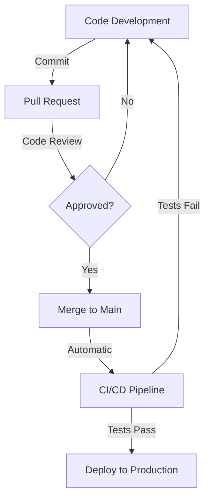

# Dhaval Rupapara

  
  
  
  

## Software Engineer & Full Stack Developer

---

## Professional Summary

Dedicated Software Engineer with expertise in full-stack development, specializing in backend systems and cloud architecture. Passionate about building scalable, efficient applications with modern technologies. Committed to writing clean, maintainable code and contributing to the developer community.

---

## Technical Expertise

### Languages

### Frontend Development

### Backend Development

### Database & Cloud

### DevOps & Tools

---

## Current Focus

- 🔧 **Backend Development**: Building robust, scalable API services
- 📚 **Learning**: TypeScript and Next.js ecosystem
- 🤝 **Open Source**: Looking to increase contributions to open source projects
- 🧪 **System Design**: Implementing efficient architecture patterns

---

## GitHub Statistics

  
  
  
  
  

## GitHub Trophies

  

## Contribution Graph

  

---

## Featured Projects

  
  

## Recent GitHub Activity

<!--START_SECTION:activity-->
1. 🔍 Opened pull request in Repository A
2. 🎉 Merged pull request in Repository B
3. 💻 Committed 20+ times to Repository C
4. 🐛 Fixed issues in Repository D
5. 📦 Released version 2.0.0 of Repository E
<!--END_SECTION:activity-->

## Contribution Metrics

  

---

## Professional Experience

I specialize in developing enterprise-grade web applications with a focus on scalability and performance. My experience includes:

- Creating and maintaining RESTful APIs and microservices
- Implementing robust database solutions
- Building responsive and accessible frontend interfaces
- Deploying and managing cloud infrastructure
- Applying DevOps principles for efficient CI/CD pipelines

## GitHub Workflow

## Coding Metrics

  

---

## Contact

I'm open to collaboration opportunities, technical discussions, and professional networking. Feel free to reach out via email or LinkedIn.

📧 **Email**: rupaparadhaval1234@gmail.com  
🔗 **LinkedIn**: [linkedin.com/in/dhaval-rupapara](https://linkedin.com/in/dhaval-rupapara/)
